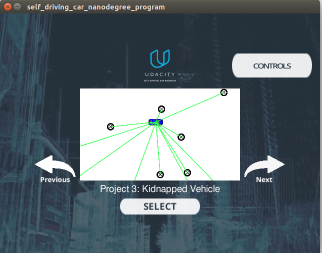
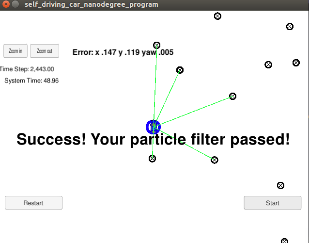

# Overview
This repository main code is from the project [CarND-Kidnapped-Vehicle-Project](https://github.com/udacity/CarND-Kidnapped-Vehicle-Project), I complete the `particle_filter.cpp` and localize the vehicle to within the desired accuracy with C++! This is a useful algo for IV.

## Project Introduction
[The introduction of it](https://github.com/udacity/CarND-Kidnapped-Vehicle-Project/blob/master/README.md): Your robot has been kidnapped and transported to a new location! Luckily it has a map of this location, a (noisy) GPS estimate of its initial location, and lots of (noisy) sensor and control data.

In this project you will implement a 2 dimensional particle filter in C++. Your particle filter will be given a map and some initial localization information (analogous to what a GPS would provide). At each time step your filter will also get observation and control data.
 And for more about project introduction, udacity is a good [resource](https://github.com/udacity/CarND-Kidnapped-Vehicle-Project/blob/master/README.md).
## Running the Code
This repository includes two files that can be used to set up and install uWebSocketIO for either Linux or Mac systems. For windows you can use either Docker, VMware, or even Windows 10 Bash on Ubuntu to install uWebSocketIO.
Fisrt of all, we need [simulator from udacity](https://github.com/udacity/self-driving-car-sim/releases). Run it and choose as follow:


Then is how to run the main code for particle filter:
1. mkdir build
2. cd build
3. cmake ..
4. make
5. ./particle_filter
We can see the succful scene:


# Implementing the Particle Filter
The directory structure of this repository is as follows:

```
root
|   build.sh
|   clean.sh
|   CMakeLists.txt
|   README.md
|   run.sh
|
|___data
|   |   
|   |   map_data.txt
|   
|   
|___src
|   |   helper_functions.h
|   |   main.cpp
|   |   map.h
|   |   particle_filter.cpp
|   |   particle_filter.h
|___image
    |  successful.jpg
    |  simulator.png
```
## Particle filter
The particle filter mainly contain three parts:
* Init: Init the num of particles and initial positions! And don't forget Gaussian noise. [ParticleFilter::init](./src/particle_filter.cpp#L30)
* Prediction: Measurements to each particle, those also need random Gaussian noise. [ParticleFilter::prediction](./src/particle_filter.cpp#L64)
* Weights update: Update the weights of each particle using a mult-variate Gaussian distribution. Also we need to transform the observation, [this is a good resource for the theory](https://www.willamette.edu/~gorr/classes/GeneralGraphics/Transforms/transforms2d.htm) and [a good resoure for the actual equation to implement](http://planning.cs.uiuc.edu/node99.html). [ParticleFilter::updateWeights](./src/particle_filter.cpp#L132)


